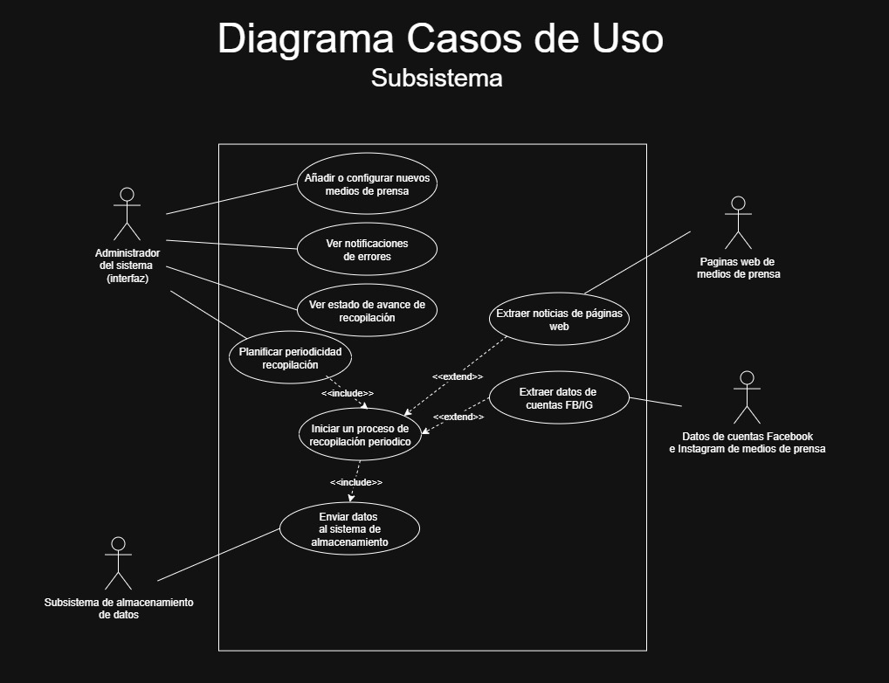
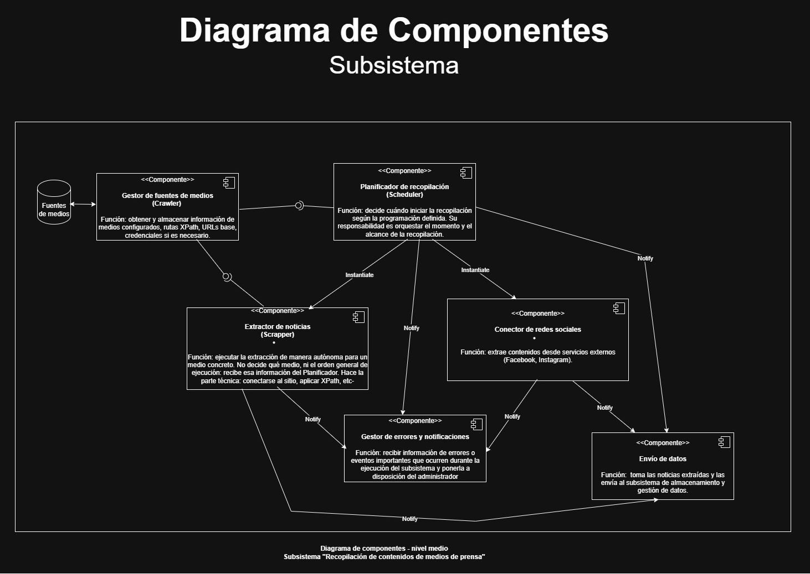
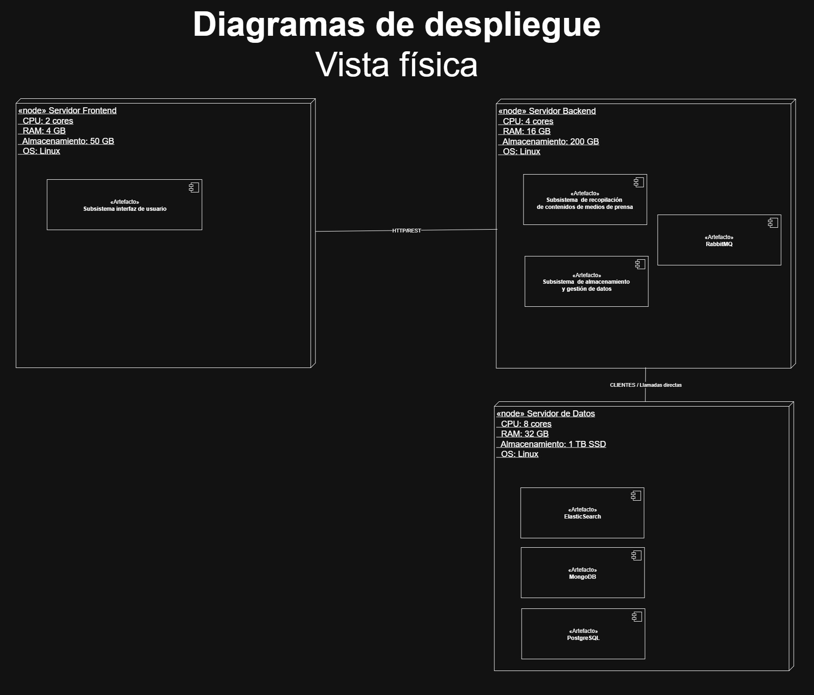

# Arquitectura del subsistema media-data-collector

El subsistema es el encargado de gestionar los distintos medios de prensa, para posteriormente tambien hacer la recolección de las noticias.
El subsistema se encuentra actualmente en la version final, esperando a su integración con el resto de subsistemas para su despliegue.

______________________________________________

## Arquitectura final

### Diagrama 1: Casos de usos

### Diagrama 2: Diagrama componentes

### Diagrama 3: Vista física

### Diagrama 4: Vista procesos
![vista_procesos] (./diagramas/vista_procesos.png)
