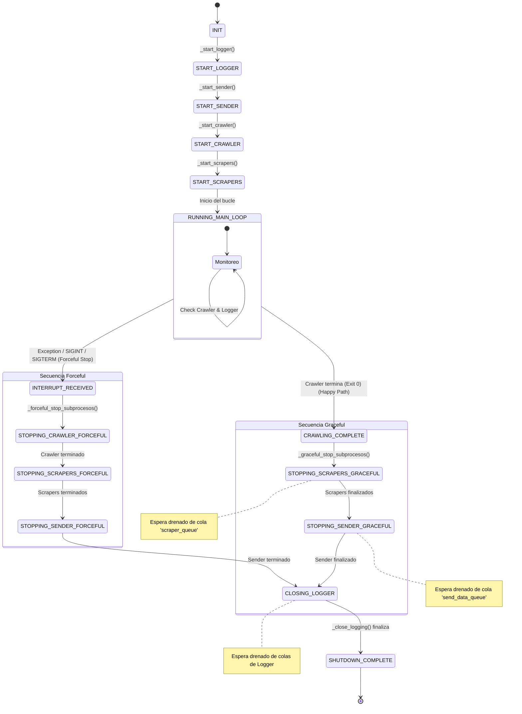

# Scheduler

El **Scheduler** es el componente orquestador del sistema `media-data-collector`. Su responsabilidad principal es gestionar el ciclo de vida completo de la recolección de noticias, asegurando que los componentes (Logger, Sender, Crawler y Scrapers) se inicien en el orden correcto, operen de manera coordinada y finalicen sus tareas de forma ordenada (*Graceful Shutdown*) o controlada en caso de error.

El Scheduler no procesa datos directamente; su función es administrar los subprocesos y mantener la estabilidad del flujo de trabajo.

## Ejecución

El Scheduler está diseñado para ejecutarse como un módulo de Python desde la raíz del proyecto. Así, se asegura que todas las importaciones relativas dentro de sus componentes funcionen correctamente.

### Requisitos previos:
1. **RabbitMQ** y **Redis** corriendo, ambos accesibles según las variables de entorno.
2. **Variables de entorno** explicitadas en el archivo `.env` en la raíz del repositorio.
3. **Entorno virtual** activado, con las dependencias de Python instaladas.

#### Comando de lanzamiento
```bash
python -m scheduler.main <medio> <n_scrapers>
````

#### Ejemplo de uso

```bash
# Ejecutar para biobiochile con 2 scrapers paralelos
python -m scheduler.main biobiochile 2
```

-----

## Componentes .py

| Componente             | Rol                                                                           |
| ---------------------- | ----------------------------------------------------------------------------- |
| **scheduler/main.py** | Punto de entrada. Parsea argumentos y configura el manejo de señales del sistema. |
| **scheduler.py** | Lógica central. Implementa la máquina de estados y el bucle principal de monitoreo. |
| **processmanager.py** | Abstracción sobre `subprocess`. Gestiona el lanzamiento y terminación (kill/terminate) de procesos. |
| **scheduler\_queue\_utils.py** | Utilidades auxiliares para verificación de colas RabbitMQ (usadas en validaciones de estado). |

## Flujo de funcionamiento

1.  **Inicialización:** El Scheduler arranca y carga las configuraciones de entorno.
2.  **Arranque secuencial:** Inicia los componentes en orden estricto para asegurar que los consumidores estén listos antes que los productores:
      * **Logger:** Se inicia primero para capturar logs desde el principio. Se le envía la señal `start_batch`.
      * **Sender:** Se inicia el proceso de envío de datos.
      * **Crawler:** Se lanza el script del crawler para el medio seleccionado.
      * **Scrapers:** Se lanzan *N* procesos scraper en paralelo.
3.  **Bucle principal (running loop):** El Scheduler entra en un ciclo infinito donde monitorea:
      * Si el Logger ha muerto inesperadamente (lo reinicia).
      * Si el Crawler ha finalizado su ejecución (exit code 0).
4.  **Detección de fin de tarea:** Cuando el Crawler termina, el Scheduler cambia su estado interno e inicia la secuencia de apagado.
5.  **Apagado ordenado (graceful shutdown):** \* Envía señal `SIGTERM` a los Scrapers y espera a que terminen de procesar su cola (`scraper_queue`).
      * Envía señal `SIGTERM` al Sender y espera a que drene su cola (`send_data_queue`).
      * Envía señal de control `end_batch_received` al Logger y espera su cierre.
6.  **Cierre:** El proceso Scheduler finaliza.

## Dependencias

#### Python (librería estándar)

El Scheduler se basa principalmente en librerías estándar para gestión de procesos y señales:

  * `subprocess`
  * `signal`
  * `time`
  * `enum`

#### Módulos internos del repositorio

  * `utils.environ_var`: Carga de configuración.
  * `utils.config_scrapers`: Mapeo de medios (como argumento) a módulos scraper (como variables de entorno).
  * `logger.queue_sender_logger_ctrl`: Comunicación con el Logger.

#### Infraestructura

  * **RabbitMQ**: Aunque el Scheduler no consume mensajes de datos, verifica el estado de las colas a través de los subprocesos para coordinar el cierre.

-----

## Módulos internos

#### Módulo `scheduler.py` (Orquestador)

Define la clase `Scheduler` y el enum `SchedulerStages`. Controla la máquina de estados del sistema.

**Estados principales (`SchedulerStages`):**

  * `INIT` -\> `START_LOGGER` -\> `START_SENDER` -\> ...
  * `RUNNING_MAIN_LOOP`: Estado estable de monitoreo.
  * `CRAWLING_COMPLETE`: Detonante del cierre natural.
  * `INTERRUPT_RECEIVED`: Detonante del cierre forzoso (ej. Ctrl+C).

#### Módulo `processmanager.py` (Gestor de Subprocesos)

Encapsula la complejidad de `subprocess.Popen`.

**Funciones clave:**

  * `launch_module()`: Ejecuta paquetes python (`python -m ...`). Usado para Logger, Sender, Scrapers.
  * `launch_script()`: Ejecuta scripts directos. Usado para Crawler.
  * `terminate_process(timeout=...)`: Envía `SIGTERM`, espera el tiempo definido, y si el proceso no muere, envía `SIGKILL`.

### Ciclo de vida y estrategia de finalización

El sistema implementa dos estrategias de cierre dependiendo del origen de la señal de parada.

#### Diagrama de Estados



#### Modos de detención:

1.  **Happy Path (Graceful):** \* Se activa cuando el Crawler termina su trabajo naturalmente.

      * **Timeout Scrapers:** 30 minutos (para permitir procesar colas largas).
      * **Timeout Sender:** 5 minutos.
      * Los procesos tienen la oportunidad de limpiar sus recursos y vaciar sus colas de RabbitMQ.

2.  **Forceful Stop:**

      * Se activa por error crítico o interrupción manual.
      * **Timeout:** 10 segundos por proceso.
      * Si no responden, se aplica `SIGKILL` inmediato.

-----

## Configuración y variables de entorno

El Scheduler carga estas variables para saber qué ejecutables lanzar.

| Variable | Descripción | Ejemplo |
| :--- | :--- | :--- |
| `LOGGER` | Ruta del módulo Logger | `logger.main` |
| `SENDDATA` | Ruta del módulo Sender | `RabbitMQ.send_data` |
| `CRAWLER` | Ruta del script Crawler | `Crawler/crawler.py` |
| `SCRAPER_BIOBIO` | Módulo Scraper específico | `scraper.scraper_biobio` |
| `SCRAPER_LATERCERA`| Módulo Scraper específico | `scraper.scraper_latercera` |

## Comunicación con Logger

El Scheduler utiliza `queue_sender_logger_ctrl.py` para enviar señales de control a la cola `logging_control_queue`.

  * `start_batch`: Se envía al inicio. Indica al Logger que limpie registros antiguos en Redis.
  * `end_batch_received`: Se envía al final de la secuencia de apagado. Indica al Logger que deje de esperar nuevos mensajes y proceda a generar métricas y cerrarse.
