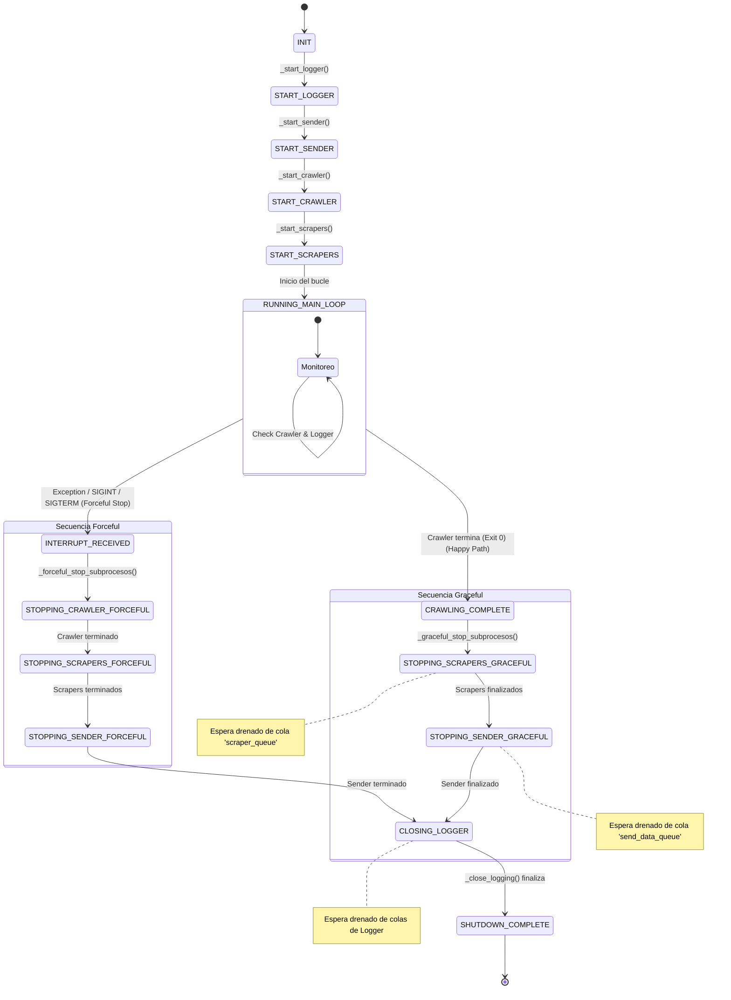

# Scheduler

## 1\. Visión General

El **Scheduler** es el componente orquestador del sistema `media-data-collector`. Su responsabilidad principal es gestionar el ciclo de vida completo de la recolección de noticias, asegurando que los componentes (Logger, Sender, Crawler y Scrapers) se inicien en el orden correcto, operen de manera coordinada y finalicen sus tareas de forma ordenada (*Graceful Shutdown*) o controlada en caso de error.

El Scheduler no procesa datos directamente; su función es administrar los subprocesos y mantener la estabilidad del flujo de trabajo.

## 2\. Ciclo de Vida del Proceso (Lifecycle)

El Scheduler opera como una **Máquina de Estados Finitos** definida en el enum `SchedulerStages`.

### Diagrama de Estados

## 3\. Estrategia de Gestión de Procesos

El Scheduler utiliza la clase auxiliar `ProcessManager` para abstraer la complejidad de la librería `subprocess` de Python.

### Tipos de Lanzamiento

1.  **Módulos (`launch_module`):** Para componentes que son paquetes Python (Logger, Sender, Scraper). Se ejecutan con `python -m <ruta_modulo>`.
2.  **Scripts (`launch_script`):** Para componentes standalone (Crawler). Se ejecutan directamente por su ruta de archivo.

### Estrategia de Finalización (Shutdown)

Existen dos modos de detener los subprocesos:

1.  **Wait & Terminate (Happy Path):** Utilizado cuando el flujo es natural. Se envía una señal `SIGTERM`. Los subprocesos (Scraper/Sender) interceptan esta señal, terminan de procesar su cola actual RabbitMQ y se cierran por sí mismos. El Scheduler espera un `timeout` de 30 minutos para el Scraper y de 5 minutos para el Sender.
2.  **Terminate/Kill (Forced):** Utilizado en interrupciones manuales o errores. Envía `SIGTERM` a los procesos secuencialmente. Si el proceso no responde al `SIGTERM` en diez segundos, se fuerza el cierre con `SIGKILL`.

## 4\. Comunicación y Señalización

El Scheduler se comunica con otros componentes (principalmente el Logger) a través de RabbitMQ usando colas de control.

  * **`logging_batch_send`**: Envía señales de control al Logger.
      * `start_batch`: Indica el inicio de una nueva ejecución. Limpia logs antiguos.
      * `end_batch_received`: Indica al Logger que debe prepararse para cerrar una vez procese lo que queda de sus colas.
      * `end_batch_completed`: No se recibe en la cola de control. Es una entrada registrada directamente por el Logger en Redis cuando ya está cerrando.

> **Nota sobre RabbitMQ:** El Scheduler implementa lógica de reconexión automática (`reset_connection`) para evitar errores de `Heartbeat Timeout` o `EOF` durante periodos largos de inactividad mientras espera que el Crawler termine.

## 5\. Configuración

El Scheduler depende de las siguientes variables de entorno (cargadas vía `utils.environ_var`):

| Variable | Descripción | Ejemplo |
| :--- | :--- | :--- |
| `LOGGER` | Ruta del módulo Logger | `logger.main` |
| `SENDDATA` | Ruta del módulo Sender | `RabbitMQ.send_data` |
| `CRAWLER` | Ruta del script Crawler | `Crawler/crawler.py` |
| `SCRAPER_BIOBIO` | Módulo Scraper específico | `scraper.scraper_biobio` |
| `SCRAPER_LATERCERA`| Módulo Scraper específico | `scraper.scraper_latercera` |

El mapeo entre el nombre del medio (como argumento de ejecución) y su variable de entorno se define en `utils.config_scrapers.SCRAPER_MAP`.

## 6\. Monitoreo y Recuperación de Errores

El bucle principal (`run`) realiza las siguientes comprobaciones:

1.  **Salud del Logger:** Si el proceso del Logger muere inesperadamente, el Scheduler intenta reiniciarlo automáticamente sin enviar la señal `start_batch` (para preservar los logs existentes).
2.  **Estado del Crawler:** Monitorea el código de salida (`poll()`) para determinar cuándo pasar a la fase de finalización de Scrapers.
3.  **Manejo de Excepciones:** Cualquier excepción no controlada en el hilo principal desencadena una parada forzosa (`_forceful_stop_subprocesos`) y envía una alerta a la cola de errores atendida por el Logger.
